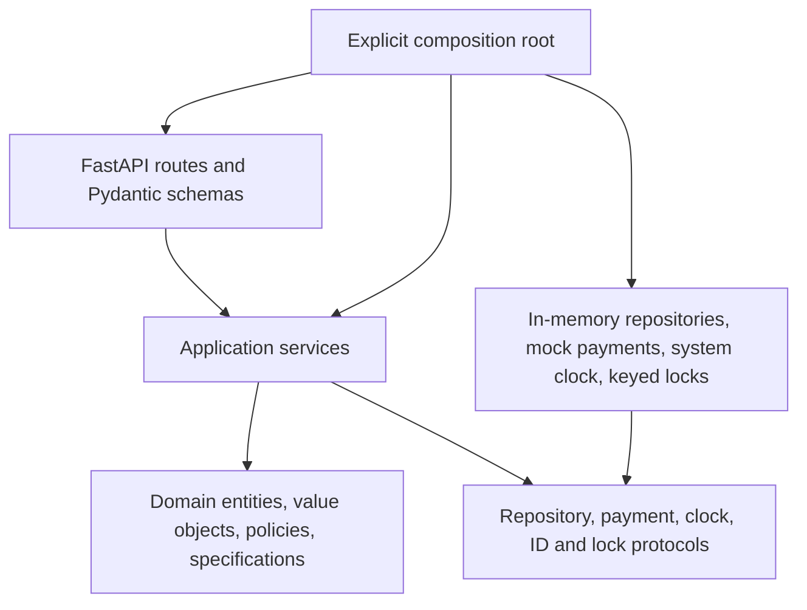
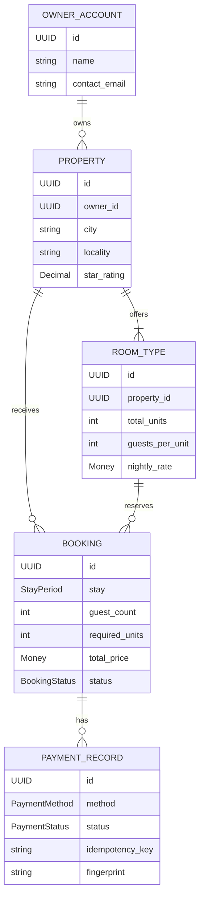
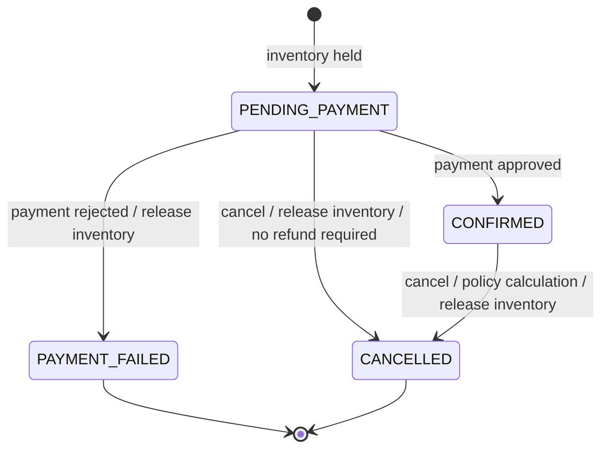
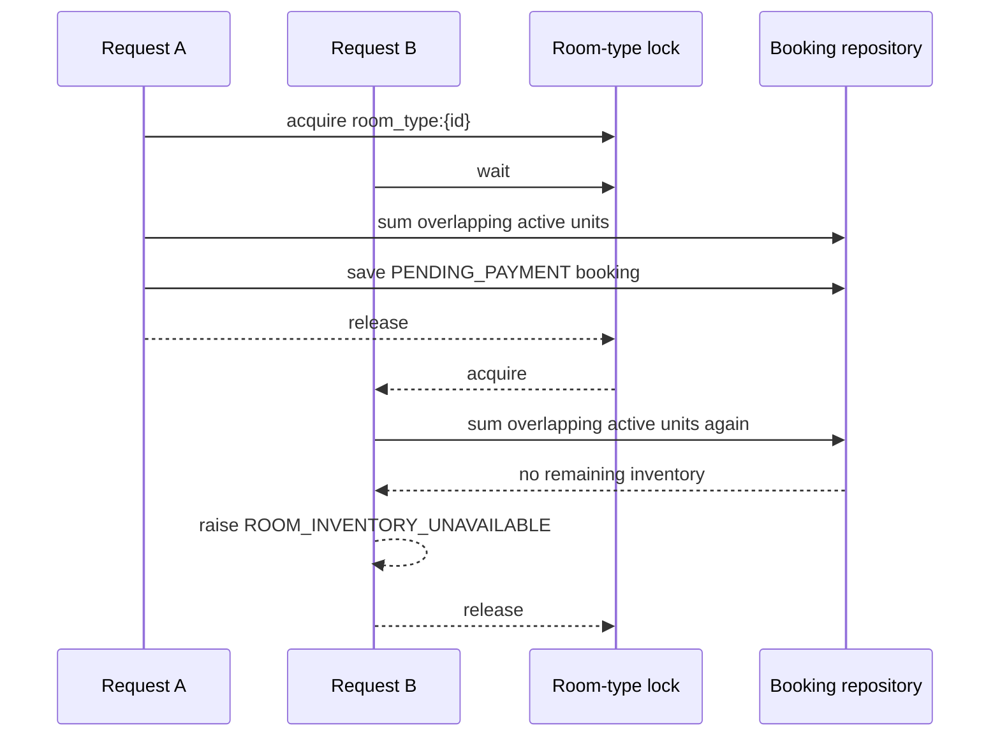

# Hotieler design notes

This document is an interview aid for the backend implementation. The README remains the
entry point for running and exercising the service.

## Dependency direction



The domain has no dependency on FastAPI, Pydantic, or infrastructure. Routes validate and
map transport data; application services coordinate use cases; entities and policies own
business invariants; adapters provide replaceable side effects.

## Domain relationships



`StayPeriod` is a half-open interval: `[check_in, check_out)`. `Money` and `StayPeriod`
are immutable value objects. A booking snapshots the required units and price so later
catalog changes cannot rewrite an accepted quote.

## Booking state machine



Only pending and confirmed bookings reserve inventory. Transition methods live on
`Booking`; invalid transitions are domain conflicts. Cancellation records its calculation
so a safe replay cannot release inventory or calculate a second result. The aggregate
also verifies that refund currency, amount, percentage, and status agree, so a faulty
replacement policy cannot persist an impossible cancellation record.

## Availability and booking race



Search never promises inventory: it is an advisory read. Booking creation performs the
same availability calculation inside the keyed critical section. Lock granularity is a
room type, so unrelated inventory can be booked concurrently. The lock is process-local,
matching the in-memory/single-worker scope; a multi-instance design would move the
invariant into a transactional database or distributed inventory allocator.

## Observability and failure flow

```mermaid
sequenceDiagram
    participant C as Client
    participant M as Request middleware
    participant A as API / application
    participant E as Error handler
    participant L as JSON logger

    C->>M: HTTP request + optional X-Request-ID
    M->>M: validate ID or generate UUID; start timer
    M->>A: request with correlation state
    A->>L: safe business event fields
    alt normal or mapped business response
        A-->>M: response
        M->>L: http_request_completed
        M-->>C: response + X-Request-ID
    else unexpected exception
        A-->>M: exception
        M->>L: http_request_failed + stack trace
        M-->>E: re-raise
        E-->>C: stable 500 envelope + X-Request-ID
    end
```

Logs are one-line JSON records. The request event contains the correlation ID, method,
route template, status, and duration. Business events add selected identifiers and state
values. The formatter accepts a fixed field allowlist; request bodies, email addresses,
idempotency keys, mock outcomes, and payment credentials are not emitted.
`HOTIELER_LOG_LEVEL` controls the application logger, while Uvicorn access logging is
disabled to avoid a second uncorrelated request stream.

Validation and domain failures use the same public error envelope and are logged as
structured rejection events. Unexpected failures expose only
`INTERNAL_SERVER_ERROR`; the stack trace remains server-side. This is useful evaluator
diagnostics, not a claim of production monitoring: there is no metrics backend, trace
exporter, alerting, or centralized retention in this submission.

## Payment consistency boundary

Payment commands acquire locks in a fixed order: the idempotency key first, then the
booking. This makes same-key replay and booking-state transitions serializable inside the
single process. A stored payment record snapshots the booking status at processing time,
so replay returns the original payment result even if the booking was cancelled later.

The current adapters do not provide a transaction spanning `BookingRepository` and
`PaymentRepository`. After the mock processor returns, `PaymentService` transitions and
saves the booking, then saves the payment record. A repository failure or process crash
between those writes can therefore leave a transitioned booking without its payment
record. That failure mode is accepted for deterministic in-memory assessment adapters; it
must not be described as production-grade payment atomicity.

With durable infrastructure, the booking transition, payment result, and idempotency
record belong in one database transaction. A real external provider also needs a persisted
attempt before dispatch, an outbox or equivalent delivery boundary, idempotent signed
webhooks, and reconciliation for ambiguous outcomes.

## Extension examples

### Payment method

Implement the `PaymentProcessor` protocol for the new method and register it by method
key. Booking/payment services continue to depend on the common contract; their state
transition logic is unchanged.

### Search filter

Add a specification/predicate for the new criterion and compose it into the search query.
Inventory evaluation and result mapping remain unchanged. This avoids a growing conditional
chain in the API route.

### Cancellation policy

Implement the `CancellationPolicy` protocol and inject the selected policy into the
cancellation service. The service still owns orchestration while the policy owns refund
calculation and cutoff rules.

### Pricing

Implement `PricingStrategy` and inject it into booking/search services. The standard
strategy remains `nights * required_units * nightly_rate`; no speculative dynamic-pricing
rules are included.

## Trade-offs

| Decision | Benefit | Cost / boundary |
|---|---|---|
| In-memory repositories behind protocols | Small, deterministic assessment slice | Restart loses state; no cross-process transactions |
| One Uvicorn worker | Process-local locks enforce the invariant | Vertical-only runtime until storage/locking changes |
| Pending booking as inventory hold | Payment cannot oversell after booking creation | Holds never expire in this version |
| Deterministic mock payment | Success and failure are testable without credentials | No gateway webhook or uncertain external outcome |
| Booking-time snapshots | Historical price and capacity calculation stay stable | Catalog edits do not reprice existing bookings |
| Calendar-day refund policy | Boundaries are simple and testable | Real systems need time zone, property, and rate-plan rules |
| Request fingerprint idempotency | Safe payment replay with conflict detection | Durable storage is required before horizontal scaling |
| JSON request/business logs | Correlatable evaluator diagnostics without extra runtime services | No centralized retention, metrics, traces, or alerting |
| Separate booking/payment saves | Keeps repository ports narrow for the in-memory assessment | No atomic commit across records; production needs a transaction and reconciliation |

## Likely follow-up questions

**Why not a generic repository or base service?** Narrow use-case protocols expose only
operations consumers need. Generic abstractions would hide domain intent without buying a
real substitution point.

**How would PostgreSQL change booking?** In one transaction, lock the room-type inventory
row (or use an atomic capacity ledger), recompute overlapping active reservations, insert
the booking, and commit. Add database uniqueness for idempotency keys and use retry rules
for serialization/deadlock errors.

**How would payment become asynchronous?** Persist a payment attempt before dispatch,
model pending/unknown gateway outcomes, consume signed webhooks idempotently, and reconcile
ambiguous attempts rather than retrying blindly.

**Can the current payment flow survive a crash between writes?** No. The booking and
payment repositories have no shared transaction. A production adapter would commit the
state transition, payment result, and idempotency record atomically, while an outbox and
reconciliation process would cover the external-provider boundary.

**How would holds expire?** Give pending bookings an expiry timestamp, exclude expired
holds during authoritative availability checks, and run an idempotent cleanup/reconciliation
job. Payment confirmation must atomically reject an already expired hold.

**Why store required units and quoted total?** They are facts accepted when the booking was
made. Recomputing them from mutable room capacity or rates would corrupt history and refund
calculations.
