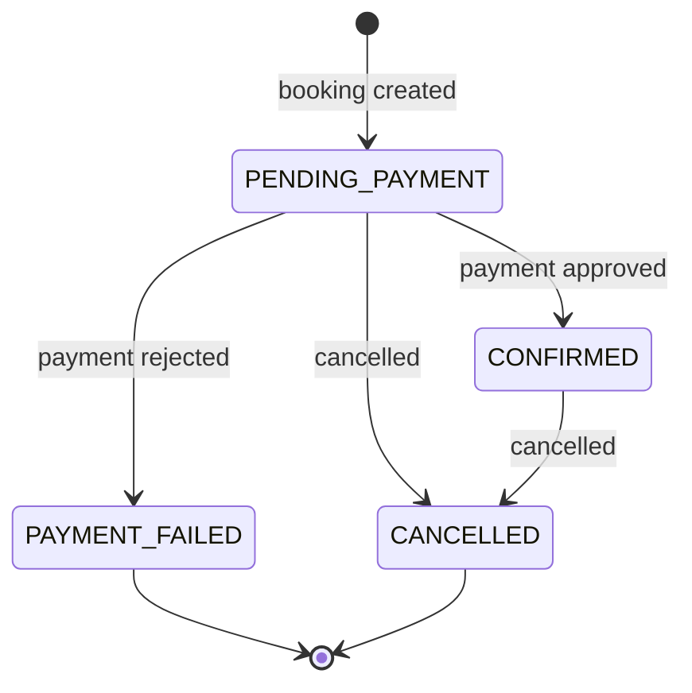

# Hotel Booking Service


[](https://github.com/ssinha2103/Hotieler/actions/workflows/ci.yml)

This backend-only service supports property onboarding, availability search,
inventory-safe booking, deterministic mock payments, cancellation, and refund calculation.
See [DESIGN.md](DESIGN.md) for its architecture, invariants, and trade-offs.

## Design overview

| Engineering concern | Implementation |
|---|---|
| Domain modelling | Immutable `Money` and `StayPeriod` value objects; entity-owned booking transitions |
| OOP and SOLID | Narrow ports, strategy objects, adapters, specifications, and an explicit composition root |
| Inventory correctness | Authoritative availability check under a room-type keyed lock |
| Payment safety | Required idempotency keys, request fingerprints, replay, and conflict semantics |
| Testability | Deterministic clock/ID seams, isolated in-memory stores, and mock payment processors |
| API design | Versioned REST endpoints, stable errors, OpenAPI examples, and grouped Swagger operations |
| Operability | Correlated request IDs, structured JSON request/business logs, and safe `500` responses |
| Failure handling | Explicit rejected-payment, invalid-transition, cancellation, and inventory-conflict paths |
| Reproducibility | One-command Docker startup, container-only quality gates, and an isolated runtime smoke test |

> **Implementation language note:** the original brief specifies Java 17 and Spring Boot.
> Python 3.12 and FastAPI were explicitly approved for this implementation.

The service intentionally has no frontend, authentication, production database, real
payment integration, or real refund movement. These exclusions keep the implementation
focused on backend design and correctness.

## Quick start

The only prerequisite is Docker Engine with Docker Compose v2. No host Python, `uv`, or
virtual environment is required.

```bash
./run.sh
```

The launcher builds the image, starts the API in the background, waits for it to become
healthy, and opens Swagger when a desktop browser opener is available.

| Resource | URL |
|---|---|
| Swagger UI | <http://localhost:8000/docs> |
| ReDoc | <http://localhost:8000/redoc> |
| OpenAPI JSON | <http://localhost:8000/openapi.json> |
| Health check | <http://localhost:8000/health> |

Useful launcher commands:

```bash
./run.sh --no-open       # start without opening a browser
./run.sh seed            # create optional local sample data through the public APIs
./run.sh status          # show container and health status
./run.sh logs            # follow API logs
./run.sh restart         # rebuild and return to an empty in-memory catalog
./run.sh test            # run all tests in Docker
./run.sh stop            # remove the Compose resources
./run.sh help            # show all supported options
```

## Guided Swagger demo

Every normal start is intentionally empty. A fresh clone therefore exposes the real API
without silently creating owners, properties, bookings, or payments. For a faster local
walkthrough, start the service and opt in to sample catalog data:

```bash
./run.sh --no-open
./run.sh seed
```

`seed` is a local convenience command, not a private data-loading endpoint. It creates its
sample owner and properties by calling the same public `POST /api/v1/owners` and
`POST /api/v1/owners/{owner_id}/properties` operations that a caller uses in Swagger.
The normal validation, application services, and in-memory repositories are therefore
exercised; the domain is not bypassed by a special schema or direct repository mutation.
There is no SQL or database seed because this implementation intentionally uses in-memory
persistence and contains no database, ORM, or migration layer. In other words,
`./run.sh seed` is a developer-side API client, not application startup behavior.

After seeding, use the identifiers and future dates printed by the command for this flow:

1. Search with `GET /api/v1/properties/search`.
2. Create a hold with `POST /api/v1/bookings`.
3. Copy the booking ID into `POST /api/v1/bookings/{booking_id}/payments`.
4. Supply a unique `Idempotency-Key` header and simulate `APPROVED` or `REJECTED`.
5. Inspect the authoritative state with `GET /api/v1/bookings/{booking_id}`.
6. For an approved booking, cancel it and search again to observe released inventory.

Swagger separates operations into **Owners**, **Properties & Search**, **Bookings**,
**Payments**, and **Runtime** groups. Request and response examples are embedded in the
OpenAPI document.

Because persistence is in memory, a restart discards both manually created and locally
seeded records and returns the service to a clean catalog:

```bash
./run.sh restart --no-open
```

## Core workflow and invariants



Only `PENDING_PAYMENT` and `CONFIRMED` bookings reserve inventory. A rejected payment or
cancellation therefore releases the held units immediately.

For each half-open stay `[check_in, check_out)`:

```text
required_units = ceil(guest_count / guests_per_unit)
peak_reserved_units = maximum active units on any night of the requested stay
available_units = total_units - peak_reserved_units
quoted_total = nights * required_units * nightly_rate
```

Room types are pooled interchangeable inventory; no physical room number is assigned.
Consequently, adjacent or staggered bookings are counted together only on nights when they
actually coexist. Search results are advisory; booking creation repeats the peak-occupancy
calculation while holding `room_type:{id}`. This prevents overselling inside the deliberately
single-process runtime.

Every payment request requires an `Idempotency-Key`. A retry with the same key and the
same booking, method, and mock outcome returns the original result. Reusing the key for a
different request returns `409 Conflict`.

## REST API

All business endpoints are versioned under `/api/v1`.

| Method | Path | Purpose |
|---|---|---|
| `GET` | `/health` | Report application health |
| `POST` | `/api/v1/owners` | Create an owner account |
| `POST` | `/api/v1/owners/{owner_id}/properties` | Add a property with nested room types |
| `GET` | `/api/v1/properties/search` | Search room types with live availability |
| `POST` | `/api/v1/bookings` | Recheck availability and hold inventory |
| `GET` | `/api/v1/bookings/{booking_id}` | Read authoritative booking state |
| `POST` | `/api/v1/bookings/{booking_id}/payments` | Execute a deterministic mock payment |
| `POST` | `/api/v1/bookings/{booking_id}/cancel` | Cancel a booking and record its refund calculation |

Mock payment methods are `CARD`, `UPI`, and `WALLET`; outcomes are `APPROVED` and
`REJECTED`. The API never accepts card details, UPI IDs, wallet credentials, OTPs, or
other payment secrets.

Business errors use one stable envelope:

```json
{
  "error": {
    "code": "ROOM_INVENTORY_UNAVAILABLE",
    "message": "The requested room inventory is no longer available.",
    "details": {}
  }
}
```

## Request tracing and structured logs

Every HTTP response includes `X-Request-ID`. A caller-supplied ID is reused only when it is
1-64 characters, starts with an alphanumeric character, and otherwise contains only
alphanumerics, `.`, `_`, or `-`; the API generates an opaque UUID for anything else. This
lets a caller correlate a response with its log event without exposing request bodies
or payment credentials.

Application logs are one-line JSON records. Request-completion records include the request
ID, method, route template, status, and duration. Selected business events add stable
resource IDs and lifecycle statuses. Email addresses, idempotency keys, request bodies,
and payment credentials are deliberately not logged. Follow the records with:

```bash
./run.sh logs
```

The default level is `INFO`; set `HOTIELER_LOG_LEVEL` when starting or restarting:

```bash
HOTIELER_LOG_LEVEL=DEBUG ./run.sh restart --no-open
```

Unexpected exceptions return the same stable error shape with code
`INTERNAL_SERVER_ERROR`; internal exception details stay in the server logs and are not
returned to the client.

## Repository shape

The dependency rule is API -> application -> domain/ports, with infrastructure adapters
wired only at the composition root. The domain imports neither FastAPI nor infrastructure.

```text
Hotieler/
├── DESIGN.md                   # focused architecture and trade-offs
├── Dockerfile                  # locked, non-root, single-worker runtime
├── compose.yaml                # local runtime and healthcheck
├── run.sh                      # Docker-only launcher
├── scripts/
│   ├── docker-smoke.sh         # isolated runtime acceptance gate
│   └── seed_local_data.py      # opt-in client of the public onboarding APIs
├── src/hotieler/
│   ├── api/                    # HTTP schemas, routes, errors, observability
│   ├── application/            # use cases, ports, and result models
│   ├── domain/                 # entities, value objects, policies, specifications
│   ├── infrastructure/         # repositories, locks, clocks, mock payments
│   ├── container.py            # explicit dependency composition
│   └── main.py                 # FastAPI application factory
└── tests/
    ├── unit/                   # domain, service, extension, adapter contracts
    ├── integration/            # HTTP, OpenAPI, and observability flows
    └── concurrency/            # inventory, payment, and cancellation races
```

## Testing and quality gates

Branch coverage is enforced at 90%. Exact test and coverage results are generated by the
commands below rather than duplicated as a number that can become stale.

```bash
make test              # complete test suite
make test-unit         # domain, service, and adapter behavior
make test-integration  # complete REST and OpenAPI flows
make test-concurrency  # deterministic race scenarios
make coverage          # branch coverage report
make lint              # Ruff format and lint checks
make typecheck         # mypy strict application check
make verify            # all quality gates plus import compilation
make smoke             # isolated container health/OpenAPI/runtime assertions
```

Every Python command above runs in a disposable Docker container. `make smoke` additionally
proves that the built API becomes healthy, serves OpenAPI, runs as a non-root user, and has
exactly one Uvicorn process. Barrier-backed concurrency tests cover
overselling, same-key payment replay, payment-versus-cancellation races, and inventory
reuse after rejection or cancellation. `make lock` refreshes the committed `uv.lock`
inside Docker.

## Important assumptions

Stays use half-open calendar intervals and must begin today or later. Search price filters
apply to nightly rate; amenity matching is normalized, case-insensitive, and all-of.
Amounts use `Decimal` and travel as strings. Pending-payment holds do not expire.

The default cancellation policy calculates 100% at least two days before check-in, 50%
one day before, and 0% on check-in day; later cancellation is rejected. This is only a
recorded refund calculation: no funds move and no refund provider is called. Pending
cancellation records a zero refund as `NOT_REQUIRED`; repeated cancellation returns the
same result.

## Intentional limitations and production evolution

State is lost when the container restarts, and startup deliberately does not restore or
seed it. Docker is used as a reproducible local environment, not presented as a
production deployment design. The Compose service runs exactly one Uvicorn worker because
both inventory locks and repositories are process-local.

Payment handling is serialized by idempotency-key and booking locks, but the in-memory
booking and payment records are written to two repositories without a shared transaction.
An adapter failure or process crash between those writes could leave a transitioned booking
without its payment record. This is an explicit implementation boundary, not a production
atomicity claim.

A production evolution would introduce PostgreSQL transactions with row-level or
optimistic inventory control, durable idempotency records, expiring holds, a persisted
payment-attempt/outbox and reconciliation flow, asynchronous payment and refund webhooks,
authentication and authorization, centralized log collection plus metrics/tracing, and
multi-instance coordination. Those concerns are intentionally outside this service's
current scope.
