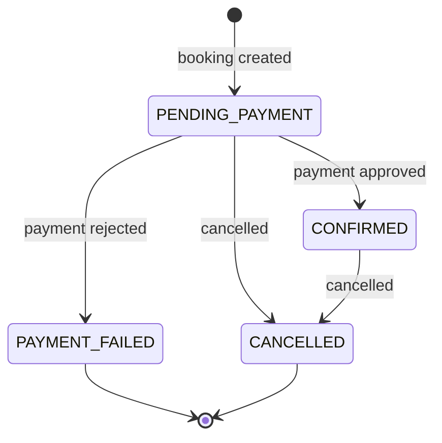
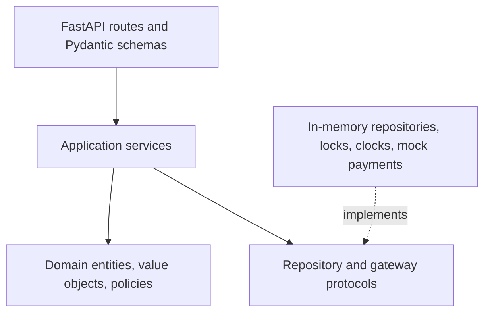

# Hotieler


[](https://github.com/ssinha2103/Hotieler/actions/workflows/ci.yml)

Hotieler is a backend-only hotel booking service built to demonstrate domain modelling,
correct inventory handling under concurrency, payment idempotency, and replaceable
infrastructure boundaries. It supports property onboarding, availability search,
inventory-safe booking, deterministic mock payments, cancellation, and refunds.

## What this project demonstrates

| Engineering concern | Evidence in Hotieler |
|---|---|
| Domain modelling | Immutable `Money` and `StayPeriod` value objects; entity-owned booking transitions |
| OOP and SOLID | Narrow ports, strategy objects, adapters, specifications, and an explicit composition root |
| Inventory correctness | Authoritative availability check under a room-type keyed lock |
| Payment safety | Required idempotency keys, request fingerprints, replay, and conflict semantics |
| Testability | Deterministic clock/ID seams, isolated in-memory stores, and mock payment processors |
| API design | Versioned REST endpoints, stable errors, OpenAPI examples, and grouped Swagger operations |
| Failure handling | Explicit rejected-payment, invalid-transition, cancellation, and inventory-conflict paths |
| Reproducibility | One-command Docker startup and all quality checks executed inside containers |

> **Assessment language note:** the original brief specifies Java 17 and Spring Boot.
> The recruiter explicitly approved Python 3.12 and FastAPI for this submission. That
> approval correspondence should be retained alongside the submitted repository.

The service intentionally has no frontend, authentication, production database, or real
payment integration. These exclusions keep the implementation focused on the assessment's
backend design and correctness criteria. The deeper design rationale is in
[DESIGN.md](DESIGN.md).

## Quick start

The only prerequisite is Docker Engine with Docker Compose v2. No host Python, `uv`, or
virtual environment is required.

```bash
./run.sh
```

The launcher builds the image, starts the API in the background, waits for it to become
healthy, and opens Swagger when a desktop browser opener is available.

| Resource | URL |
|---|---|
| Swagger UI | <http://localhost:8000/docs> |
| ReDoc | <http://localhost:8000/redoc> |
| OpenAPI JSON | <http://localhost:8000/openapi.json> |
| Health check | <http://localhost:8000/health> |

Useful launcher commands:

```bash
./run.sh --no-open       # start without opening a browser
./run.sh status          # show container and health status
./run.sh logs            # follow API logs
./run.sh restart         # reset in-memory state and rebuild
./run.sh test            # run all tests in Docker
./run.sh stop            # remove the Compose resources
./run.sh help            # show all supported options
```

## Guided Swagger demo

Compose enables demo seeding by default and starts with one owner, two properties, and
four room types. The application factory itself remains unseeded unless that runtime flag
is enabled. No bookings or payments are pre-created, so both approval and rejection
journeys begin with clean inventory.

1. Open the **Demo** group and execute `GET /api/v1/demo-data`.
2. Copy one of the returned query examples into `GET /api/v1/properties/search`.
3. Use the returned request body with `POST /api/v1/bookings`.
4. Copy the new booking ID into `POST /api/v1/bookings/{booking_id}/payments`.
5. Supply the example `Idempotency-Key` header and simulate `APPROVED` or `REJECTED`.
6. Inspect the authoritative state with `GET /api/v1/bookings/{booking_id}`.
7. For an approved booking, cancel it and search again to observe released inventory.

Swagger separates operations into **Demo**, **Owners**, **Properties & Search**,
**Bookings**, **Payments**, and **Runtime** groups. Request and response examples are
embedded in the OpenAPI document.

Reset all in-memory changes and obtain fresh demo IDs with:

```bash
./run.sh restart --no-open
```

To start with an empty catalog:

```bash
HOTIELER_SEED_DEMO_DATA=false ./run.sh restart --no-open
```

## Core workflow and invariants



Only `PENDING_PAYMENT` and `CONFIRMED` bookings reserve inventory. A rejected payment or
cancellation therefore releases the held units immediately.

For each half-open stay `[check_in, check_out)`:

```text
required_units = ceil(guest_count / guests_per_unit)
available_units = total_units - overlapping units held by active bookings
quoted_total = nights * required_units * nightly_rate
```

Adjacent stays do not overlap. Search results are advisory; booking creation repeats the
availability calculation while holding `room_type:{id}`. This prevents overselling inside
the deliberately single-process runtime.

Every payment request requires an `Idempotency-Key`. A retry with the same key and the
same booking, method, and mock outcome returns the original result. Reusing the key for a
different request returns `409 Conflict`.

## REST API

All business endpoints are versioned under `/api/v1`.

| Method | Path | Purpose |
|---|---|---|
| `GET` | `/health` | Report application health |
| `GET` | `/api/v1/demo-data` | Return seeded IDs and ready-to-use demo requests |
| `POST` | `/api/v1/owners` | Create an owner account |
| `POST` | `/api/v1/owners/{owner_id}/properties` | Add a property with nested room types |
| `GET` | `/api/v1/properties/search` | Search room types with live availability |
| `POST` | `/api/v1/bookings` | Recheck availability and hold inventory |
| `GET` | `/api/v1/bookings/{booking_id}` | Read authoritative booking state |
| `POST` | `/api/v1/bookings/{booking_id}/payments` | Execute a deterministic mock payment |
| `POST` | `/api/v1/bookings/{booking_id}/cancel` | Cancel a booking and calculate its refund |

Mock payment methods are `CARD`, `UPI`, and `WALLET`; outcomes are `APPROVED` and
`REJECTED`. The API never accepts card details, UPI IDs, wallet credentials, OTPs, or
other payment secrets.

Business errors use one stable envelope:

```json
{
  "error": {
    "code": "ROOM_INVENTORY_UNAVAILABLE",
    "message": "The requested room inventory is no longer available.",
    "details": {}
  }
}
```

## Architecture



The domain imports neither FastAPI, Pydantic, nor infrastructure code. An explicit
composition root wires application services to thread-safe, copy-safe in-memory
repositories and deterministic mock adapters.

```text
src/hotieler/
├── api/             # HTTP schemas, routes, documentation, error mapping
├── application/     # use cases, ports, and application result models
├── domain/          # entities, value objects, policies, specifications
├── infrastructure/  # repositories, locking, clocks, mock payments
├── container.py     # explicit dependency composition
├── demo_data.py     # deterministic Swagger demonstration fixture
└── main.py          # FastAPI application factory

tests/
├── unit/            # domain, policies, services, and adapter contracts
├── integration/     # complete HTTP flows and OpenAPI behavior
└── concurrency/     # inventory, payment, and cancellation races
```

## Testing and quality gates

The current verified baseline is **103 passing tests** with **94.79% branch coverage**.
Coverage is enforced at 90%.

| Test layer | Count | Primary purpose |
|---|---:|---|
| Unit | 72 | Domain invariants, policies, services, and adapter contracts |
| Integration | 23 | Complete REST journeys, failures, demo data, and OpenAPI behavior |
| Concurrency | 8 | Inventory oversell, idempotency, payment, and cancellation races |

```bash
make test              # complete test suite
make test-unit         # domain, service, and adapter behavior
make test-integration  # complete REST and OpenAPI flows
make test-concurrency  # deterministic race scenarios
make coverage          # branch coverage report
make lint              # Ruff format and lint checks
make typecheck         # mypy strict application check
make verify            # all quality gates plus import compilation
```

Every Python command above runs in a disposable Docker container. The concurrency tests
use barriers rather than timing sleeps and prove:

- simultaneous requests for one remaining unit produce exactly one booking;
- total active reservations never exceed inventory;
- concurrent retries with one payment key process once and replay safely;
- payment and cancellation races finish in a valid state without deadlock;
- rejected and cancelled bookings return inventory for reuse.

## Key design decisions

| Decision | Reason | Deliberate trade-off |
|---|---|---|
| Derive availability from active bookings | Avoid a second mutable counter that can drift | Search cost grows with in-memory bookings |
| Lock by room type | Serialize only requests competing for the same inventory | Guarantee is process-local |
| Keep price and required units on the booking | Preserve the original commercial decision | Later catalog edits do not reprice old bookings |
| Model payment outcomes explicitly | Make success, rejection, replay, and conflicts testable | No real provider integration |
| Use narrow protocols at variation points | Keep persistence, payment, policy, clock, and ID generation replaceable | Avoid generic abstraction layers |
| Run one API worker | Storage and locks are in memory | Horizontal scaling requires durable coordination |

## Domain assumptions

- Dates are calendar dates; stays must begin today or later.
- Check-out is exclusive and later than check-in.
- Search price filters apply to the nightly room rate, not the total quote.
- Requested amenities use normalized, case-insensitive all-of matching across property and
  room amenities.
- Search ordering is currency, quoted total, property name, then room type.
- Monetary arithmetic uses `Decimal`; JSON amounts are strings.
- Pending-payment holds do not expire in this assessment version.
- Cancellation at least two days before check-in refunds 100%; one day before refunds
  50%; the check-in date refunds 0%; cancellation after check-in is rejected.
- Cancelling a pending booking releases inventory without creating a refund.
- Repeated cancellation returns the recorded result and never releases inventory twice.

## Intentional limitations and production evolution

State is lost when the container restarts. Docker is used as a reproducible evaluator
environment, not presented as a production deployment design. The Compose service runs
exactly one Uvicorn worker because both inventory locks and repositories are process-local.

A production evolution would introduce PostgreSQL transactions with row-level or
optimistic inventory control, durable idempotency records, expiring holds, asynchronous
payment and refund webhooks, authentication and authorization, observability, and
multi-instance coordination. Those concerns are intentionally outside this machine-coding
submission.

## Dependency maintenance

Dependencies are resolved through the committed `uv.lock`. Regenerate it without
installing `uv` on the host:

```bash
make lock
```
